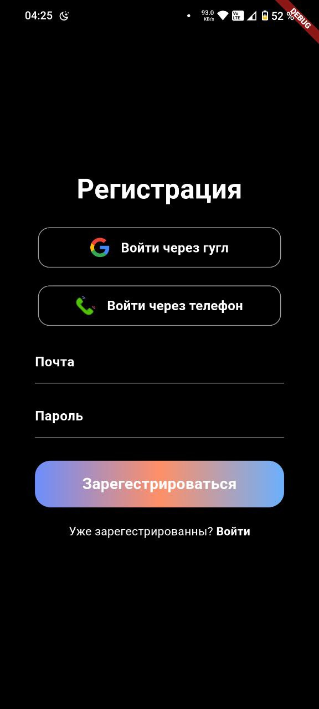
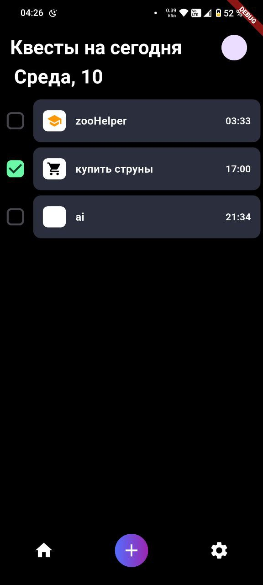
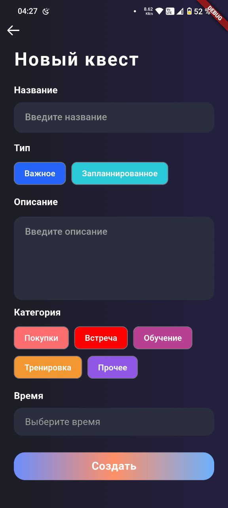

LifeQuest

     

LifeQuest — это мобильное приложение для управления задачами и заметками с поддержкой планирования времени. Приложение позволяет пользователям создавать напоминания, устанавливать сроки выполнения и синхронизировать данные между устройствами через Firebase.

✨ Возможности
🔐 Регистрация и аутентификация через Firebase Auth

📝 Создание и управление заметками с текстом и временем выполнения

⏰ Уведомления о предстоящих задачах

☁️ Облачная синхронизация через Firestore Database

📱 Нативное быстродействие на Android устройствах

🎨 Интуитивный интерфейс с Material Design

🛠 Технологический стек
Frontend: Flutter, Dart 

Backend: Firebase (Authentication, Firestore Database)

Уведомления: Firebase Cloud Messaging (FCM)

Сборка: Gradle, Android SDK

📸 Скриншоты

     

🚀 Установка и запуск
Предварительные требования
Установленный Flutter SDK (версия 3.13.9 или выше)

Android Studio с эмулятором или физическое Android-устройство

Аккаунт Firebase
